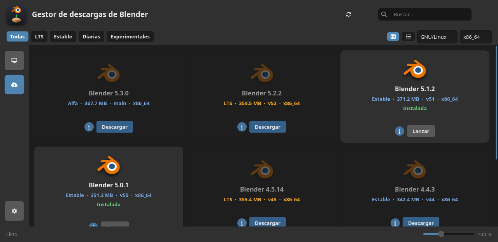
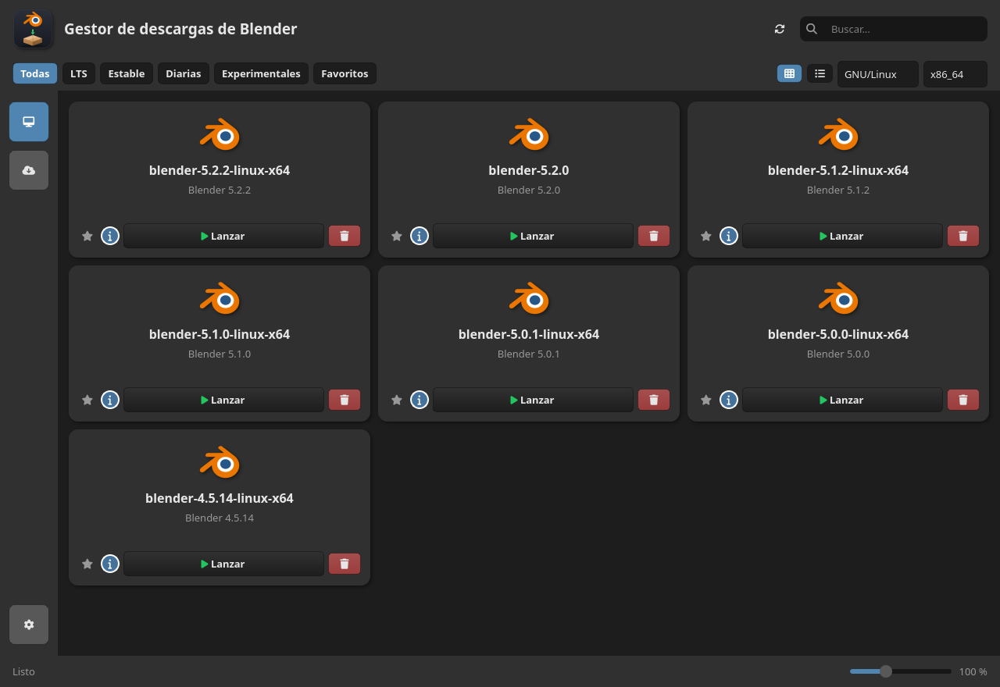
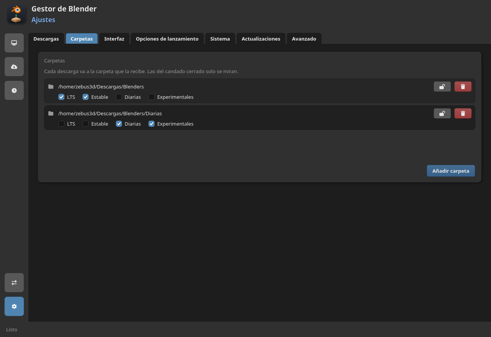
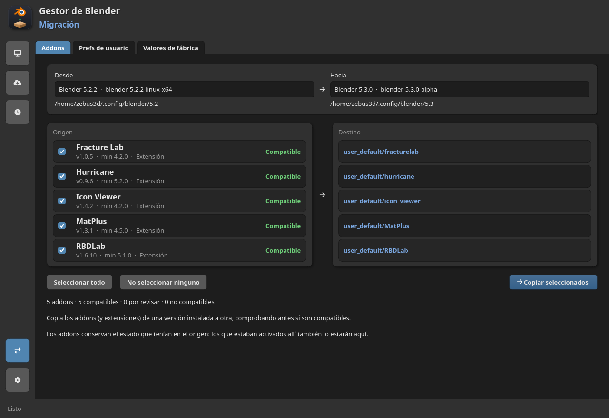
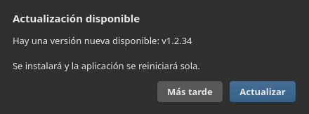

# Blender Manager

A desktop app for Linux, Windows and macOS that keeps your Blender versions in
one place: browse the official builds (and the Bforartists and UPBGE forks),
download the one you want and launch or remove it without going through a
browser. It is written in Python with PySide6/Qt and ships as a single portable
file, so there is nothing to install.

<p align="center">
  
</p>

<sub>The store in grid view. Versions already on disk are marked Local, and the
channel tabs and search narrow the list down.</sub>

## What it does

- **Find a build.** All the official builds in one screen, with channel tabs
  (All, LTS, Stable, Daily, Experimental and Favorites), a search box and a
  grid or list view with a zoom slider (`Ctrl +` / `Ctrl -`, `Ctrl 0` for the
  default). Star the versions you use and they gather under Favorites; each
  card has a small **i** that opens that series' release notes.
- **Or a Blender fork.** Bforartists and UPBGE are separate programs built on
  Blender, and they have their own tabs once you turn them on in
  **Settings → Downloads**. They download, install and launch like any other
  version, with their own executable and config folder, so a Bforartists 5.2
  never gets mixed up with a Blender 5.2.
- **Download it.** The app detects your system and architecture, but you can
  also pick Windows, macOS or ARM64 to grab a build for another machine.
  Downloads show progress, are checked with SHA-256 and are unpacked for you
  (`.tar.xz`, `.zip`, or a `.dmg` that is mounted and copied out on macOS). If
  the destination is a protected folder such as `C:\Program Files`, the app
  asks Windows for permission instead of failing.
- **Manage what you have.** Launch or uninstall any installed version, rename
  it in place (the folder on disk is renamed too), or launch it with the
  console visible. When Blender publishes something newer, a same-series patch
  offers an inline update and a new major series is offered in a dialog you
  can accept or ignore for that series.

<p align="center">
  
</p>

<sub>Installed versions (Local). Filters and search work here too, and launching
starts Blender detached, so closing the manager leaves it running.</sub>

- **Keep versions in more than one folder.** Each folder is set to receive a
  kind of build (LTS on a fast disk, dailies on a big one) and every kind has a
  single owner, so a download is never ambiguous.
  - A folder can be **locked** to read-only: its versions are still listed,
    launched and used to migrate add-ons, but the app never downloads, deletes
    or renames anything there. That is how you point it at versions you
    installed by hand.
  - Moving what you have to a different folder is safe: files are copied first
    and the source is removed only once the copy is complete.
  - You can also remove every folder; the app warns when a kind of build has
    nowhere to go instead of quietly picking a destination for you.

<p align="center">
  
</p>

<sub>Settings → Folders: each folder receives the kinds of build you tick, and a
locked folder is only scanned.</sub>

- **Migrate your setup to another version.** A transfer board shows the add-ons
  of one installed version and where each one lands, with a compatibility check
  (Blender version and Python wheels) before anything is copied. The enabled
  state is carried over, the last migration can be undone, and preferences can
  be copied whole or key by key: the app compares them against Blender's
  defaults and lists only what you changed, using Blender's own names.

<p align="center">
  
</p>

<sub>Migrating add-ons from one installed version to another, with the
compatibility verdict shown before you copy anything.</sub>

- **A few more things.** Factory-reset a version and restore your settings
  later; open recent `.blend` files with the newest version of their series;
  manage a version's add-ons without opening Blender (behind the experimental
  toggle in Settings); tray icon and autostart; interface in English, Spanish,
  Simplified Chinese, Russian, Japanese and Brazilian Portuguese, detected
  from your locale; and a portable mode that keeps settings next to the
  executable. Opening the app twice does not create a second window: the one
  already running comes to the front.
- **It updates itself.** Packaged builds replace themselves and restart (the
  Linux AppImage in place, Windows and macOS through a small helper); a source
  checkout runs `git pull --ff-only` and restarts. Checks run on start and at
  an interval you choose, and a version you skip is not offered again.

<p align="center">
  
</p>

<sub>The in-app update dialog. Packaged builds install the new version and
restart on their own.</sub>

## Running from source

You need **Python 3.12 or newer**. The only dependency is **PySide6**, which the
launcher script installs for you:

```bash
git clone https://github.com/zebus3d/BlenderManager.git
cd BlenderManager
./run.sh
```

`run.sh` creates `.venv` on first run and installs `requirements.txt` into it.
To do it by hand:

```bash
python3 -m venv .venv
source .venv/bin/activate        # Windows: .venv\Scripts\activate
pip install -r requirements.txt
python src/main.py
```

The app opens on the store. The first time, if you already have Blender
versions in the destination folder, it opens on the **Local** tab instead. The
default destination is `~/Descargas/Blenders`; change it in **Settings**.

### Command-line options

```bash
python src/main.py                     # open the UI
python src/main.py --debug             # UI with verbose logging
python src/main.py --smoke             # list builds in the console (no window)
python src/main.py --screenshot r.png  # start, save a screenshot and quit
```

### Portable mode

Create an empty file named `portable` next to the executable (or next to
`src/main.py` if you run from source). Settings, cache and logs are then stored
in that same folder instead of the user's config directory.

## Tests

```bash
QT_QPA_PLATFORM=offscreen .venv/bin/python -m unittest discover -t . -s tests
```

The UI tests run with Qt's **offscreen** plugin, so they need no display (the
same thing CI does). They cover the data model, the services and the parts of
the window that can be checked without a screen.

## Packaging and releases

Packaging uses **PyInstaller**. Linux produces a portable folder and, with
`--appimage`, a single `.AppImage`; Windows produces one `.exe`; macOS a
compressed `.app`.

```bash
packaging/build.sh             # dist/BlenderManager
packaging/build.sh --appimage  # also dist/BlenderManager-x86_64.AppImage
```

`.github/workflows/build.yml` runs the tests and builds the three binaries.
Every push to `main` refreshes a single rolling pre-release, and promoting it
(Actions → *promote*) turns it into the final release without rebuilding. The
in-app updater only looks at the latest *final* release, so nobody is notified
while a cycle is still in progress. Binaries are downloadable from the Release,
not committed to the repository.

The details worth knowing before touching the build (the Ubuntu 22.04 choice,
the Qt `xcb` plugin, the macOS `.dmg`, the Windows code-signing situation) are
in [`AGENTS.md`](AGENTS.md).

## Related projects

### Blender Launcher V2

[Blender Launcher V2](https://github.com/Victor-IX/Blender-Launcher-V2) is the
mature reference for this job, and this project borrows from it: the idea of
using Blender's official JSON API and the LTS version map comes from it, and so
do the two fork sources (Bforartists' public WebDAV share and UPBGE's GitHub
releases). It also covers more ground (templates, `.blend` association, more
fork types).

Blender Manager bets on the opposite: fewer features, but the common flow — find
a build, download it, launch it — with as little friction as possible. That is
why the whole app is one screen you can read at a glance, why it renders on the
CPU instead of OpenGL (so it does not care about your Mesa version), and why on
Linux it is a single AppImage instead of a choice between several downloads.

The *experimental branches* channel is usually empty: both apps read the same
endpoint, and Blender stopped publishing branch builds years ago. It is still
implemented and will light up if a branch ever appears.

### Blenderbase

[Blenderbase](https://github.com/PhysicalAddons/blenderbase-public) (by
Physical Addons) covers similar ground from a different angle: installed
versions, add-ons and recent files in one window, launching with the console,
SHA-256 checks and self-updating, built with Tauri instead of Qt. It is a good
reference point and adds a feature of its own (syncing your setup across
computers), so it is worth a look.

## Project layout

```
src/
  main.py          # entry point and arguments
  i18n.py          # translations (texts in locale/)
  model/           # plain data classes (Build, InstalledBuild)
  services/        # API, downloads, extraction, settings, updates... (no Qt)
  ui/              # PySide6 widgets; qss.py holds the whole look
doc/               # architecture guide in Spanish (start at doc/README.md)
tests/             # unit tests (unittest, UI with Qt's offscreen plugin)
packaging/         # PyInstaller spec, AppImage script and icons
run.sh             # development launcher (creates .venv if missing)
```

The code is meant to be read: `services/` knows nothing about Qt, so it can be
tested and understood on its own, and the interface is separated into the
stylesheet (`ui/qss.py`) and the widgets. The guides in [`doc/`](doc/README.md)
walk through the architecture, the Qt concepts and a worked example of adding a
feature.

## Credits

This project finishes earlier attempts of mine (`BlenderDownloader` in Qt and
`BlenderManager` in Kivy) and is inspired by Blender Launcher V2. The Kivy
version worked, but its OpenGL/SDL2 requirement broke on newer Mesa releases, so
the UI was ported to Qt Widgets.

The Blender logo is a trademark of the [Blender Foundation](https://www.blender.org/).
The Bforartists logo comes from the [Bforartists](https://github.com/Bforartists/Bforartists)
project and the UPBGE logo from [UPBGE](https://github.com/UPBGE/upbge), both
GPL-3.0; they identify those forks and all rights stay with their projects.
Icons are from [Font Awesome Free](https://fontawesome.com/) (SIL OFL 1.1).

## Privacy

Blender Manager has no accounts, no telemetry and no analytics. See
[PRIVACY.md](PRIVACY.md) for what it stores locally and which servers it talks to.

<!-- Code signing policy (SignPath): OCULTO hasta que aprueben la solicitud.
La peticion fue rechazada, asi que no se anuncia nada que no tengamos. Cuando
SignPath apruebe, descomentar esta seccion (te da la reputacion que piden en
signpath.org/terms) y volver a anadir el bloque POLICY de promote.yml.
- Committers and reviewers: [@zebus3d](https://github.com/zebus3d) (repository owner)
- Approvers: [@zebus3d](https://github.com/zebus3d) (repository owner)
-->

## License

Blender Manager is free software, released under the
[GNU General Public License v3.0](LICENSE).
Copyright (C) 2019-2026 zebus3d.
