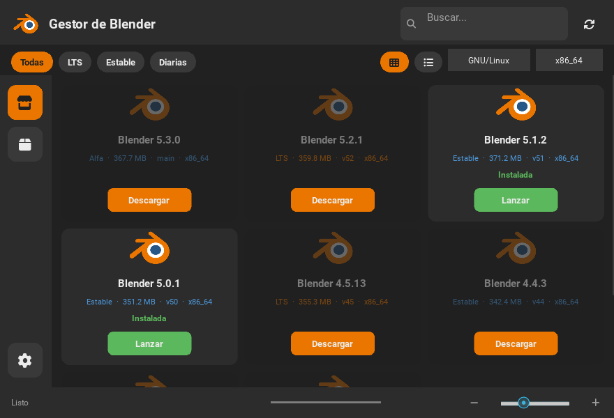
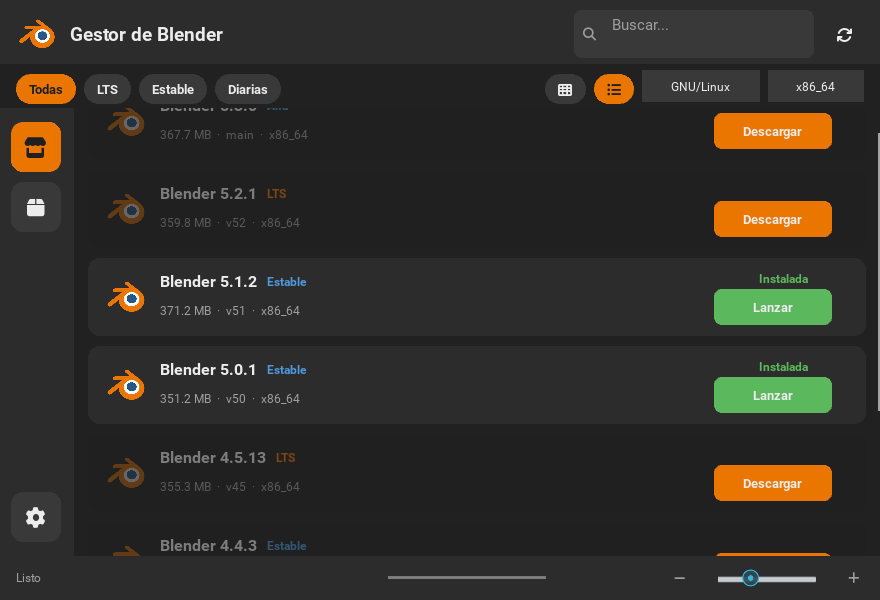

# Blender Manager

Aplicación de escritorio (Kivy) para **descubrir, descargar, organizar y lanzar**
versiones de [Blender](https://www.blender.org/): LTS, estables y de desarrollo
(diarias/alfa). Es multiplataforma (Linux, Windows y macOS) y está pensada para
ser **portable**: no requiere instalar nada una vez empaquetada.



## Características

- **Tienda de versiones** con tarjetas e iconos, filtros por canal (LTS, estables,
  diarias) y búsqueda por versión o rama.
- **Vista en cuadrícula o en filas**, con **barra de zoom** para elegir el tamaño
  de los iconos (al estilo de Dolphin).
- **Detección automática** del sistema operativo y la arquitectura.
- **Descarga con progreso**, verificación de integridad **SHA-256** y extracción
  automática (`.tar.xz` en Linux, `.zip` en Windows, `.dmg` en macOS).
- **Carpeta destino configurable** y listado de **versiones instaladas**.
- **Lanzamiento** de cualquier versión instalada con argumentos opcionales.
- **Diferenciación visual** de lo que ya está descargado.
- **Interfaz en español e inglés** con detección automática del idioma.
- **Tooltips** explicativos en los controles.
- **Modo portable**: los ajustes viven junto al ejecutable.



## Cómo ejecutar el proyecto (desde el código fuente)

Requisitos: **Python 3.12 o superior** y **Kivy**. No hace falta nada más: la
descarga, la extracción y la API de Blender usan la librería estándar.

### 1. Obtener el código

```bash
git clone https://github.com/zebus3d/BlenderManager.git
cd BlenderManager
```

### 2. Instalar Kivy

**Arch Linux** (vía recomendada: Kivy ya compilado para el Python del sistema):

```bash
sudo pacman -S python-kivy
```

**Otras distribuciones de Linux, Windows o macOS** (entorno virtual):

```bash
python3 -m venv .venv
source .venv/bin/activate        # Windows: .venv\Scripts\activate
pip install -r requirements.txt
```

### 3. Arrancar la aplicación

```bash
python3 src/main.py
```

Al abrirse verás la tienda de compilaciones. La **primera vez** se crea la
carpeta de ajustes del usuario y, al descargar la primera versión, se usará
`~/Descargas/Blenders` como destino (puedes cambiarlo en **Ajustes**).

> Si ejecutas con el entorno virtual, acuérdate de activarlo antes
> (`source .venv/bin/activate`) y usa `python` en lugar de `python3`.

### Opciones de línea de comandos

```bash
python3 src/main.py                    # abre la interfaz
python3 src/main.py --debug            # interfaz con registro detallado
python3 src/main.py --smoke            # lista compilaciones por consola (sin ventana)
python3 src/main.py --screenshot r.png # arranca, guarda una captura y sale
```

## Modo portable

Crea un archivo vacío llamado `portable` junto al ejecutable (o a `src/main.py`
si lo ejecutas desde el código). Entonces los ajustes, el caché y los registros
se guardan en esa misma carpeta en lugar de en el directorio del usuario.

## Pruebas

```bash
python3 -m unittest discover -t . -s tests -v
```

## Empaquetado

Se usa **PyInstaller** en modo *one-folder* (más rápido y depurable que
`--onefile`). La especificación es multiplataforma: `packaging/blendermanager.spec`.

Linux (binario portable y, opcionalmente, AppImage):

```bash
packaging/build.sh            # genera dist/BlenderManager
packaging/build.sh --appimage # además genera dist/BlenderManager-x86_64.AppImage
```

En Linux conviene compilar dentro de una imagen con glibc antigua
(por ejemplo `manylinux_2_28`) para que el binario funcione en más
distribuciones. De eso se encarga el flujo de GitHub Actions.

### CI (GitHub Actions)

El flujo `.github/workflows/build.yml` ejecuta las pruebas y genera artefactos
para **Linux** (`.tar.gz` + `.AppImage`), **Windows** (`.zip`) y **macOS** (`.app`
comprimido). Se lanza al empujar una etiqueta `v*` o manualmente.

## Requisitos de la compilación de Linux

Blender Launcher V2 pedía glibc 2.31; aquí, compilando en `manylinux_2_28`, el
binario portable requiere **glibc 2.28 o superior**, lo que cubre la mayoría de
distribuciones actuales. El **AppImage** no necesita instalar nada, aunque en
sistemas sin `libfuse2` hay que ejecutarlo con `--appimage-extract-and-run`.

## Estructura del proyecto

```
src/
  main.py            # punto de entrada y argumentos
  paths.py           # rutas (código fuente vs. empaquetado)
  i18n.py            # traducciones es/en
  model/build.py     # modelo de datos (Build, InstalledBuild)
  services/
    api.py           # consulta la API JSON de Blender y cachea
    detector.py      # sistema operativo y arquitectura
    settings.py      # ajustes persistentes y modo portable
    downloader.py    # descarga en hilo con progreso y SHA-256
    extractor.py     # extracción segura de tar/zip
    installed.py     # escaneo de versiones instaladas
    launcher.py      # lanzamiento de Blender
  ui/
    theme.py         # paleta, colores y fuente de iconos
    icons.py         # glifos de Font Awesome
    widgets.py       # tarjetas, barra lateral y controlador principal
    tooltip.py       # sistema de tooltips
  views/gui.kv       # interfaz declarativa (Kivy Language)
  assets/            # logo de Blender y fuente de iconos
tests/               # pruebas unitarias (unittest)
packaging/           # spec de PyInstaller, AppImage y .desktop
```

## Créditos

Este proyecto retoma y termina dos intentos propios anteriores
(`BlenderDownloader` en Qt y `BlenderManager` en Kivy) y se inspira en
[Blender Launcher V2](https://github.com/Victor-IX/Blender-Launcher-V2): de él
viene la idea de usar la API JSON de Blender y el mapa de versiones LTS, que
evitan el scraping frágil de las primeras versiones.

El logo de Blender es una marca de la [Blender Foundation](https://www.blender.org/).
Los iconos son de [Font Awesome Free](https://fontawesome.com/) (SIL OFL 1.1).
